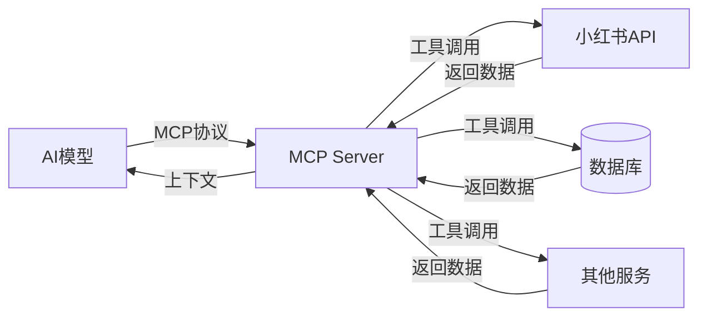
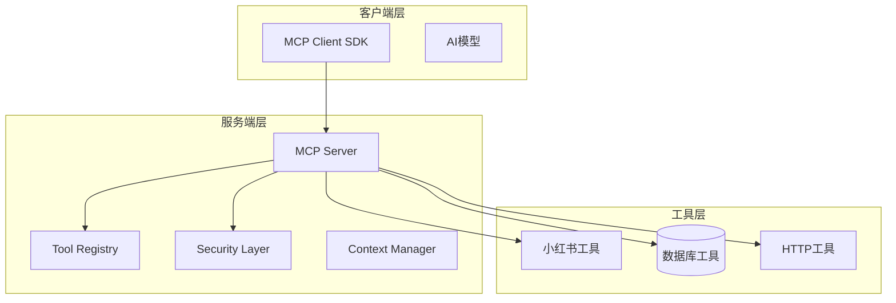
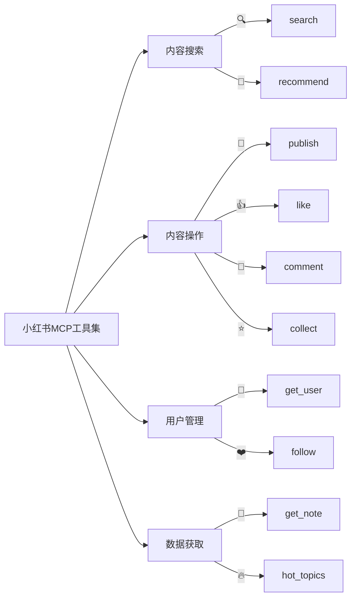
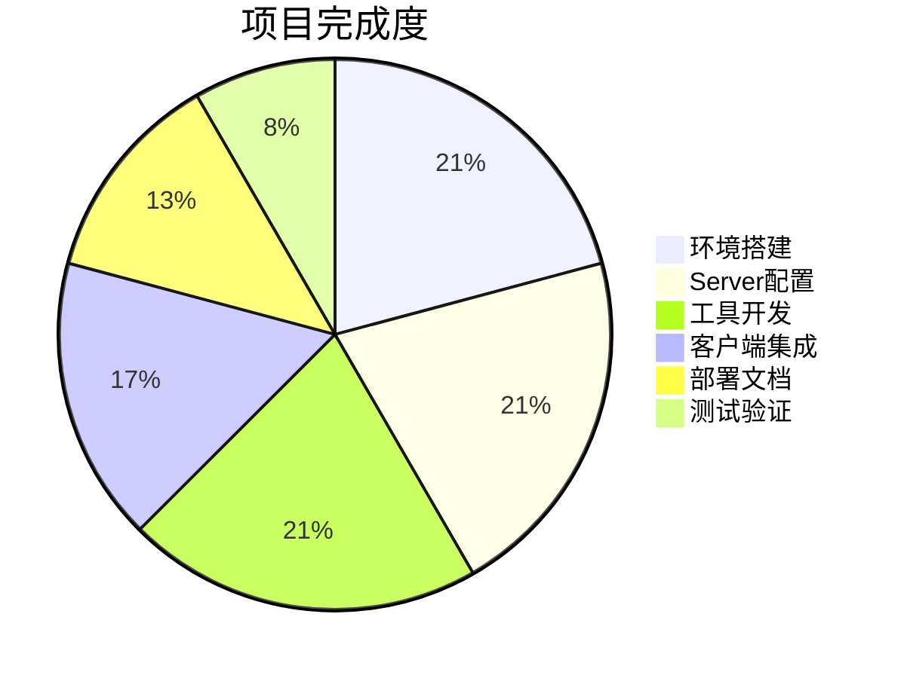

# MCP环境搭建与小红书MCP部署项目实战

**Model Context Protocol 实战课程**

探索AI模型与外部工具的连接之道

---

## 📋 目录

| 阶段 | 内容 | 状态 |
|------|------|------|
| 01 | MCP概述与架构 | ✅ |
| 02 | 环境准备与安装 | ✅ |
| 03 | MCP Server搭建 | ✅ |
| 04 | 小红书工具开发 | ✅ |
| 05 | 客户端集成与部署 | ✅ |
| 06 | 功能演示与总结 | ✅ |

---

## 🔗 什么是 MCP?

**MCP (Model Context Protocol)**

用于连接AI模型与外部工具的标准化协议



---

## ✨ MCP核心价值

| 价值 | 描述 | 图标 |
|------|------|------|
| 能力扩展 | 让AI模型具备调用外部工具的能力 | 🚀 |
| 标准接口 | 统一的工具调用协议 | 🔗 |
| 安全可控 | 权限管理与执行隔离 | 🔒 |
| 插件化设计 | 工具可插拔，易于扩展 | 📦 |

---

## 🏗️ MCP架构详解



---

## 📦 第一阶段：环境准备

### 系统要求检查

| 软件 | 版本要求 | 状态 |
|------|----------|------|
| Node.js | >= 18.0.0 | ✅ |
| npm | >= 9.0.0 | ✅ |
| Git | >= 2.30 | ✅ |
| Python | >= 3.10 | ⚙️ |

```bash
node -v    # v20.10.0
npm -v     # 10.2.3
git --version  # git version 2.42.0
```

---

## 🚀 第二阶段：创建项目

### 项目初始化命令

```bash
mkdir mcp-xiaohongshu-project
cd mcp-xiaohongshu-project
npm init -y

npm install @mcp/core @mcp/server express cors
npm install -D typescript ts-node @types/node @types/express @types/cors
```

### 项目结构

```
mcp-xiaohongshu-project/
├── src/
│   ├── tools/          # 工具实现
│   │   └── xiaohongshu.ts
│   ├── server/         # MCP服务端
│   │   └── index.ts
│   ├── client/         # 客户端SDK
│   │   └── index.ts
│   └── config/         # 配置文件
│       └── env.ts
├── package.json
├── tsconfig.json
└── .env
```

---

## ⚙️ 第三阶段：配置 TypeScript

创建 `tsconfig.json`:

```json
{
  "compilerOptions": {
    "target": "ES2022",
    "module": "ESNext",
    "moduleResolution": "bundler",
    "strict": true,
    "esModuleInterop": true,
    "skipLibCheck": true,
    "outDir": "./dist",
    "rootDir": "./src",
    "resolveJsonModule": true
  },
  "include": ["src/**/*"],
  "exclude": ["node_modules"]
}
```

---

## 🔍 第四阶段：实现小红书工具

### 小红书平台首页


### 工具列表

| 工具名称 | 功能描述 | 分类 |
|---------|---------|------|
| xiaohongshu_search | 搜索笔记 | 内容搜索 |
| xiaohongshu_get_note | 获取笔记详情 | 数据获取 |
| xiaohongshu_publish | 发布笔记 | 内容操作 |
| xiaohongshu_get_user | 获取用户信息 | 用户管理 |
| xiaohongshu_hot_topics | 获取热门话题 | 数据获取 |
| xiaohongshu_like | 点赞笔记 | 内容操作 |
| xiaohongshu_comment | 评论笔记 | 内容操作 |
| xiaohongshu_follow | 关注用户 | 用户管理 |

---

## 🗺️ 工具功能架构



---

## 🔗 第五阶段：客户端集成

### 客户端SDK封装

```typescript
import { createClient } from '@mcp/core'

const client = createClient({
  serverUrl: 'http://localhost:8080',
  apiKey: process.env.MCP_API_KEY,
})

export async function searchNotes(keyword: string, options?: { page?: number; limit?: number }) {
  const result = await client.execute('xiaohongshu_search', {
    keyword, page: options?.page || 1, limit: options?.limit || 10,
  })
  return result.success ? result.data : null
}

export async function getHotTopics(limit?: number) {
  const result = await client.execute('xiaohongshu_hot_topics', { limit: limit || 10 })
  return result.success ? result.data : null
}
```

---

## 🚢 部署方案

### 部署架构


### Docker部署

```bash
# Dockerfile
FROM node:20-alpine
WORKDIR /app
COPY package*.json ./
RUN npm ci --only=production
COPY dist/ ./dist/
EXPOSE 8080
CMD ["node", "dist/server.js"]

# 运行命令
docker build -t mcp-server .
docker run -d -p 8080:8080 mcp-server
```

### PM2管理

```bash
pm2 start ecosystem.config.js
pm2 monit
```

---

## 🎯 功能演示

```typescript
import { searchNotes, getHotTopics, likeNote, followUser } from './client'

async function demoAllFeatures() {
  console.log('=== 1. 搜索笔记 ===')
  const searchResults = await searchNotes('旅行攻略', { limit: 3 })
  console.log('找到:', searchResults.data.length, '条笔记')

  console.log('\n=== 2. 获取热门话题 ===')
  const topics = await getHotTopics(5)
  topics.data.forEach(t => console.log(`${t.rank}. ${t.name}`))

  console.log('\n=== 3. 点赞笔记 ===')
  await likeNote('note_123')
  console.log('点赞成功!')

  console.log('\n=== 4. 关注用户 ===')
  await followUser('user_456')
  console.log('关注成功!')
}

demoAllFeatures()
```

---

## 📊 项目进度统计



---

## 📈 项目总结

### ✅ 已完成工作

- 环境搭建与依赖安装
- MCP Server配置与启动
- 小红书工具开发（8个工具）
- 客户端SDK封装
- Docker与PM2部署方案
- 安全防护配置

### 🔮 未来扩展

- 扩展工具（发布笔记、数据分析）
- 模型集成（对接更多AI平台）
- 可视化仪表盘
- 批量操作功能

---

## 🎉 谢谢观看!

**MCP环境搭建与小红书MCP部署项目实战**

| 资源 | 链接 |
|------|------|
| 📖 官方文档 | https://mcp.dev |
| 💻 代码仓库 | https://github.com |
| 📧 联系我们 | contact@example