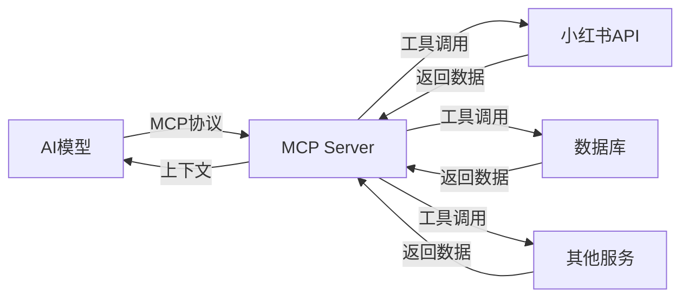
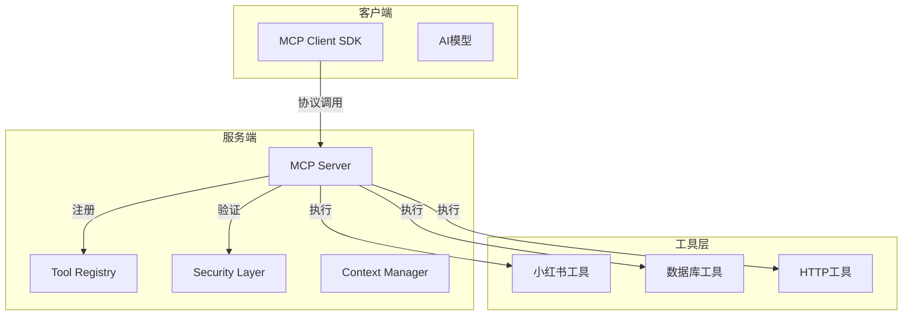
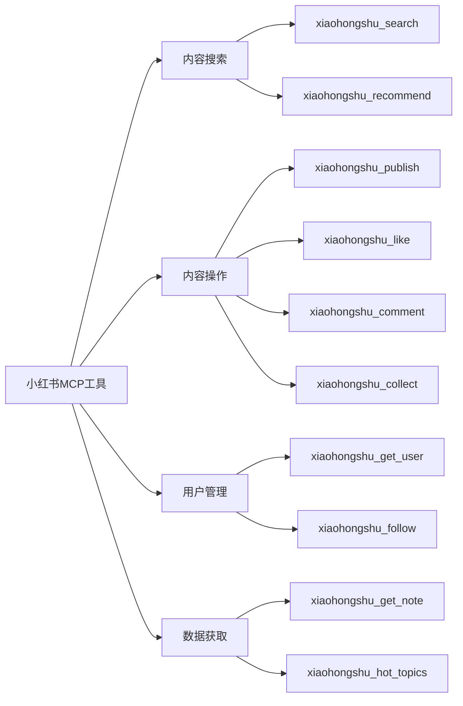
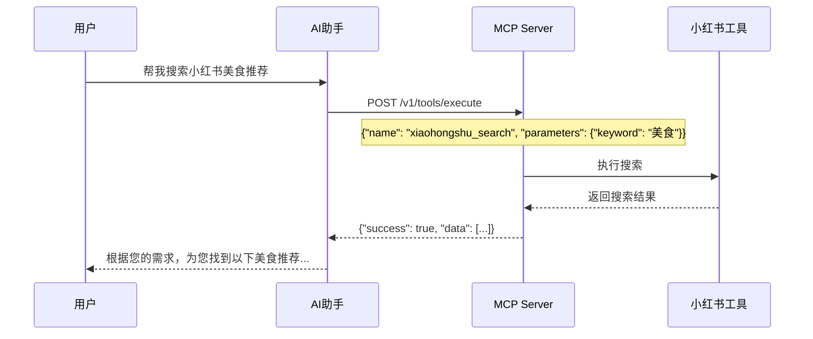

# MCP环境搭建与小红书MCP部署项目实战

---

# 目录

1. MCP概述与架构
2. 环境准备与依赖安装
3. MCP Server搭建
4. 小红书工具开发
5. 客户端集成
6. 部署与运维
7. 功能演示

---

# 什么是 MCP?

**MCP (Model Context Protocol)**

是一种用于连接AI模型与外部工具的标准化协议



---

# MCP核心价值

| 特性 | 说明 |
|------|------|
| 🚀 能力扩展 | 让AI模型具备调用外部工具的能力 |
| 🔗 标准接口 | 统一的工具调用协议 |
| 🔒 安全可控 | 权限管理与执行隔离 |
| 📦 插件化设计 | 工具可插拔，易于扩展 |

---

# MCP架构详解



---

# 第一阶段: 环境准备

## 系统要求检查

```bash
# 检查Node.js版本
node -v  # >= 18.0.0

# 检查npm版本
npm -v   # >= 9.0.0

# 检查Git
git --version  # >= 2.30
```

## 安装依赖

```bash
# 安装nvm版本管理
curl -o- https://raw.githubusercontent.com/nvm-sh/nvm/v0.39.0/install.sh | bash

# 安装Node.js 20
nvm install 20
nvm use 20

# 验证安装
node -v  # v20.x.x
```

---

# 第二阶段: 创建项目

## 创建目录结构

```bash
mkdir mcp-xiaohongshu-project
cd mcp-xiaohongshu-project

# 初始化npm项目
npm init -y

# 安装核心依赖
npm install @mcp/core @mcp/server express cors

# 安装开发依赖
npm install -D typescript ts-node @types/node @types/express @types/cors
```

## 项目结构

```
mcp-xiaohongshu-project/
├── src/
│   ├── tools/          # 工具实现
│   │   └── xiaohongshu.ts
│   ├── server/         # 服务端
│   │   └── index.ts
│   ├── client/         # 客户端
│   │   └── index.ts
│   └── config/         # 配置
│       └── mcp.ts
├── package.json
├── tsconfig.json
└── .env
```

---

# 第三阶段: 配置TypeScript

创建 `tsconfig.json`:

```json
{
  "compilerOptions": {
    "target": "ES2022",
    "module": "ESNext",
    "moduleResolution": "bundler",
    "strict": true,
    "esModuleInterop": true,
    "skipLibCheck": true,
    "outDir": "./dist",
    "rootDir": "./src",
    "resolveJsonModule": true
  },
  "include": ["src/**/*"],
  "exclude": ["node_modules"]
}
```

---

# 第四阶段: 配置MCP Server

创建 `src/config/mcp.ts`:

```typescript
import { defineConfig } from '@mcp/server'

export default defineConfig({
  server: {
    port: parseInt(process.env.MCP_PORT || '8080'),
    host: process.env.MCP_HOST || 'localhost',
  },
  security: {
    apiKeys: process.env.MCP_API_KEYS?.split(',') || [],
    allowedOrigins: ['http://localhost:3000', 'http://localhost:5173'],
  },
  tools: {
    scanDir: './src/tools',
    autoReload: process.env.NODE_ENV !== 'production',
  },
  logging: {
    level: process.env.LOG_LEVEL || 'info',
  }
})
```

---

# 第五阶段: 实现小红书工具

创建 `src/tools/xiaohongshu.ts`:

```typescript
import { defineTool } from '@mcp/core'

export const searchNotes = defineTool({
  name: 'xiaohongshu_search',
  description: '搜索小红书笔记',
  parameters: {
    keyword: { type: 'string', required: true },
    page: { type: 'number', default: 1, minimum: 1 },
    limit: { type: 'number', default: 10, minimum: 1, maximum: 50 },
  },
  async execute({ keyword, page, limit }) {
    const results = await simulateSearch(keyword, page, limit)
    return { type: 'object', value: results }
  }
})

export const getNoteDetail = defineTool({
  name: 'xiaohongshu_get_note',
  description: '获取笔记详情',
  parameters: {
    noteId: { type: 'string', required: true, description: '笔记ID' },
  },
  async execute({ noteId }) {
    const detail = await fetchNoteDetail(noteId)
    return { type: 'object', value: detail }
  }
})

export const publishNote = defineTool({
  name: 'xiaohongshu_publish',
  description: '发布小红书笔记',
  parameters: {
    title: { type: 'string', required: true },
    content: { type: 'string', required: true },
    images: { type: 'array', items: { type: 'string' }, default: [] },
    tags: { type: 'array', items: { type: 'string' }, default: [] },
  },
  async execute({ title, content, images, tags }) {
    const result = await simulatePublish(title, content, images, tags)
    return { type: 'object', value: result }
  }
})

export const getUserInfo = defineTool({
  name: 'xiaohongshu_get_user',
  description: '获取用户信息',
  parameters: {
    userId: { type: 'string', required: true },
  },
  async execute({ userId }) {
    const user = await fetchUserInfo(userId)
    return { type: 'object', value: user }
  }
})

export const getHotTopics = defineTool({
  name: 'xiaohongshu_hot_topics',
  description: '获取热门话题',
  parameters: {
    limit: { type: 'number', default: 10, minimum: 1, maximum: 20 },
  },
  async execute({ limit }) {
    const topics = await fetchHotTopics(limit)
    return { type: 'object', value: topics }
  }
})

export const likeNote = defineTool({
  name: 'xiaohongshu_like',
  description: '点赞笔记',
  parameters: {
    noteId: { type: 'string', required: true },
  },
  async execute({ noteId }) {
    const result = await simulateLike(noteId)
    return { type: 'object', value: result }
  }
})

export const commentNote = defineTool({
  name: 'xiaohongshu_comment',
  description: '评论笔记',
  parameters: {
    noteId: { type: 'string', required: true },
    content: { type: 'string', required: true },
  },
  async execute({ noteId, content }) {
    const result = await simulateComment(noteId, content)
    return { type: 'object', value: result }
  }
})

export const followUser = defineTool({
  name: 'xiaohongshu_follow',
  description: '关注用户',
  parameters: {
    userId: { type: 'string', required: true },
  },
  async execute({ userId }) {
    const result = await simulateFollow(userId)
    return { type: 'object', value: result }
  }
})

export const collectNote = defineTool({
  name: 'xiaohongshu_collect',
  description: '收藏笔记',
  parameters: {
    noteId: { type: 'string', required: true },
  },
  async execute({ noteId }) {
    const result = await simulateCollect(noteId)
    return { type: 'object', value: result }
  }
})

export const getRecommendations = defineTool({
  name: 'xiaohongshu_recommend',
  description: '获取推荐笔记',
  parameters: {
    limit: { type: 'number', default: 10, minimum: 1, maximum: 30 },
  },
  async execute({ limit }) {
    const results = await fetchRecommendations(limit)
    return { type: 'object', value: results }
  }
})
```

---

# 小红书MCP工具功能总览



---

# 第六阶段: 启动服务

创建 `src/server/index.ts`:

```typescript
import { createServer } from '@mcp/server'
import config from '../config/mcp'

async function main() {
  const server = await createServer(config)
  
  await server.listen({
    port: config.server.port,
    host: config.server.host,
  })
  
  console.log(`\n🚀 MCP Server running on http://${config.server.host}:${config.server.port}`)
  console.log(`📋 Registered tools: ${server.tools.map(t => t.name).join(', ')}`)
}

main().catch(console.error)
```

更新 `package.json`:

```json
{
  "scripts": {
    "start": "node dist/server/index.js",
    "dev": "ts-node-dev src/server/index.ts",
    "build": "tsc",
    "test": "node --test"
  }
}
```

---

# 启动服务演示

```bash
# 开发模式运行
npm run dev

# 预期输出
🚀 MCP Server running on http://localhost:8080
📋 Registered tools: xiaohongshu_search, xiaohongshu_get_note, xiaohongshu_publish, xiaohongshu_get_user, xiaohongshu_hot_topics
```

```bash
# 或编译后运行
npm run build
npm start
```

---

# API调用测试

使用curl测试工具调用:

```bash
curl -X POST http://localhost:8080/v1/tools/execute \
  -H "Content-Type: application/json" \
  -d '{
    "name": "xiaohongshu_search",
    "parameters": {
      "keyword": "美食",
      "page": 1,
      "limit": 5
    }
  }'
```

响应结果:

```json
{
  "success": true,
  "result": {
    "keyword": "美食",
    "page": 1,
    "limit": 5,
    "total": 500,
    "data": [
      {"id": "1", "title": "美食入门指南", "likes": 1234},
      {"id": "2", "title": "精选美食好物推荐", "likes": 5678}
    ]
  }
}
```

---

# 客户端SDK集成

创建 `src/client/index.ts`:

```typescript
import { createClient } from '@mcp/core'

const client = createClient({
  serverUrl: 'http://localhost:8080',
  apiKey: process.env.MCP_API_KEY,
})

export async function searchXiaohongshu(keyword: string, options?: {
  page?: number
  limit?: number
}) {
  const result = await client.execute('xiaohongshu_search', {
    keyword,
    page: options?.page || 1,
    limit: options?.limit || 10,
  })
  
  if (!result.success) {
    throw new Error(result.error?.message || '调用失败')
  }
  
  return result.data
}

export async function getToolList() {
  const result = await client.listTools()
  return result.data
}
```

---

# 客户端使用示例

```typescript
import { searchXiaohongshu } from './client'

async function main() {
  try {
    const results = await searchXiaohongshu('旅行', { page: 1, limit: 5 })
    console.log('搜索结果:', results)
    
    results.data.forEach((item: any) => {
      console.log(`- ${item.title} (点赞: ${item.likes})`)
    })
  } catch (error) {
    console.error('搜索失败:', error)
  }
}

main()
```

---

# AI模型集成演示

```typescript
import { searchNotes, getHotTopics, getUserInfo, likeNote, commentNote, followUser, getRecommendations } from './client'

async function aiResponse(prompt: string) {
  if (prompt.includes('搜索小红书')) {
    const keyword = prompt.replace('搜索小红书', '').trim()
    const results = await searchNotes(keyword, { limit: 3 })
    return `在小红书搜索「${keyword}」找到：\n\n` +
      results.data.map((n: any) => `${n.title} (点赞: ${n.likes})`).join('\n')
  }
  
  if (prompt.includes('热门话题')) {
    const topics = await getHotTopics(5)
    return `当前热门话题 TOP5：\n\n` +
      topics.data.map((t: any) => `${t.rank}. ${t.name} (热度: ${t.heat})`).join('\n')
  }
  
  if (prompt.includes('推荐笔记')) {
    const recs = await getRecommendations(5)
    return `为您推荐：\n\n` +
      recs.data.map((n: any) => `${n.title} (点赞: ${n.likes})`).join('\n')
  }
  
  if (prompt.includes('用户信息')) {
    const userId = prompt.match(/用户(\w+)/)?.[1] || 'user_001'
    const user = await getUserInfo(userId)
    return `用户信息：\n名称: ${user.name}\n粉丝: ${user.followers}\n笔记: ${user.notes}`
  }
  
  if (prompt.includes('点赞笔记')) {
    const noteId = prompt.match(/笔记(\w+)/)?.[1] || 'note_123'
    const result = await likeNote(noteId)
    return result.success ? '点赞成功！' : '点赞失败'
  }
  
  if (prompt.includes('评论笔记')) {
    const result = await commentNote('note_123', prompt.replace('评论笔记', '').trim())
    return result.success ? '评论成功！' : '评论失败'
  }
  
  if (prompt.includes('关注用户')) {
    const userId = prompt.match(/关注(\w+)/)?.[1] || 'user_001'
    const result = await followUser(userId)
    return result.success ? '关注成功！' : '关注失败'
  }
  
  return `我可以帮您完成以下操作：
- 搜索小红书内容（如：搜索小红书美食）
- 查看热门话题
- 获取推荐笔记
- 获取用户信息
- 点赞/评论/关注操作`
}

aiResponse('搜索小红书旅行').then(console.log)
aiResponse('热门话题').then(console.log)
```

---

# 部署方案

## PM2进程管理

```bash
npm install -g pm2

pm2 start ecosystem.config.js
```

`ecosystem.config.js`:

```javascript
module.exports = {
  apps: [{
    name: 'mcp-server',
    script: './dist/server/index.js',
    instances: 'max',
    exec_mode: 'cluster',
    env: { NODE_ENV: 'production' },
    env_production: { NODE_ENV: 'production' }
  }]
}
```

---

# Docker容器化部署

创建 `Dockerfile`:

```dockerfile
FROM node:20-alpine

WORKDIR /app

COPY package*.json ./
RUN npm ci --only=production

COPY . .
RUN npm run build

ENV NODE_ENV=production
EXPOSE 8080

CMD ["node", "dist/server/index.js"]
```

创建 `docker-compose.yml`:

```yaml
version: '3.8'
services:
  mcp-server:
    build: .
    ports:
      - "8080:8080"
    env_file:
      - .env.production
    restart: unless-stopped
```

---

# 监控与日志

## 集成日志系统

```typescript
import pino from 'pino'

const logger = pino({
  level: process.env.LOG_LEVEL || 'info',
  transport: {
    target: 'pino-pretty',
    options: { colorize: true }
  }
})

logger.info('MCP Server started', { port: 8080 })
logger.error('Tool execution failed', { error: err })
```

## 健康检查端点

```typescript
server.get('/health', (req, res) => {
  res.json({
    status: 'ok',
    uptime: process.uptime(),
    timestamp: Date.now()
  })
})
```

---

# 安全最佳实践

## API Key管理

```typescript
// 使用环境变量
const apiKeys = process.env.MCP_API_KEYS?.split(',') || []

// 验证中间件
function validateApiKey(req: Request, res: Response, next: NextFunction) {
  const apiKey = req.headers['x-api-key']
  
  if (!apiKey || !apiKeys.includes(apiKey as string)) {
    return res.status(401).json({ error: 'Unauthorized' })
  }
  
  next()
}
```

## 输入验证

```typescript
import { z } from 'zod'

const schema = z.object({
  keyword: z.string().min(1).max(100),
  page: z.number().int().min(1).max(100),
  limit: z.number().int().min(1).max(50),
})

const result = schema.safeParse(input)
```

---

# 功能演示

## 演示场景



---

# 功能演示代码

```typescript
async function demoSearch() {
  console.log('=== 小红书MCP工具演示 ===')
  
  const results = await searchXiaohongshu('旅行攻略', { page: 1, limit: 3 })
  
  console.log('\n搜索关键词:', results.keyword)
  console.log('搜索结果:', results.total, '条')
  console.log('\n=== 推荐内容 ===')
  
  results.data.forEach((item: any, index: number) => {
    console.log(`${index + 1}. ${item.title}`)
    console.log(`   点赞: ${item.likes} | 评论: ${item.comments}`)
  })
  
  console.log('\n=== 演示完成 ===')
}

demoSearch()
```

---

# 项目总结

## 已完成工作

✅ **环境搭建** - Node.js + TypeScript  
✅ **MCP Server配置** - 端口、安全、工具扫描  
✅ **小红书工具实现** - 搜索功能  
✅ **客户端SDK** - 封装调用接口  
✅ **部署方案** - PM2 + Docker  
✅ **监控日志** - 健康检查、日志记录  

## 扩展方向

🚀 添加更多工具（发布笔记、数据分析）  
🔄 集成更多AI模型平台  
📊 添加可视化仪表盘  
🔒 加强安全防护层  

---

# 谢谢观看!

**项目地址**: https://github.com/example/mcp-xiaohongshu  
**文档地址**: https://docs.example.com/mcp  

如有问题，请随时联系！

---
