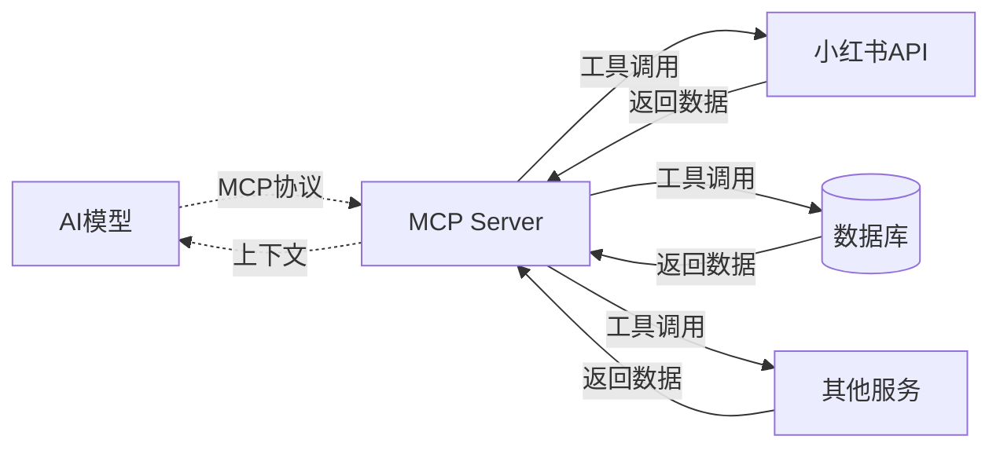
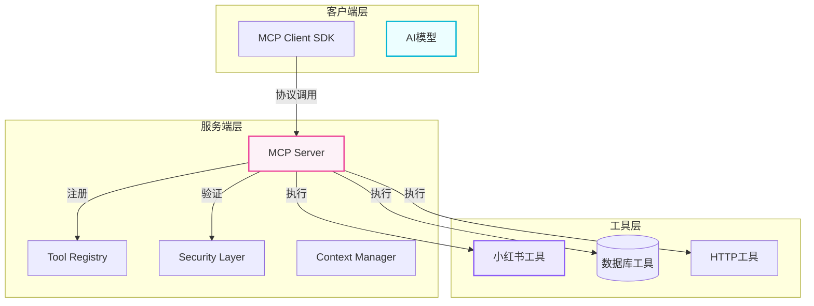
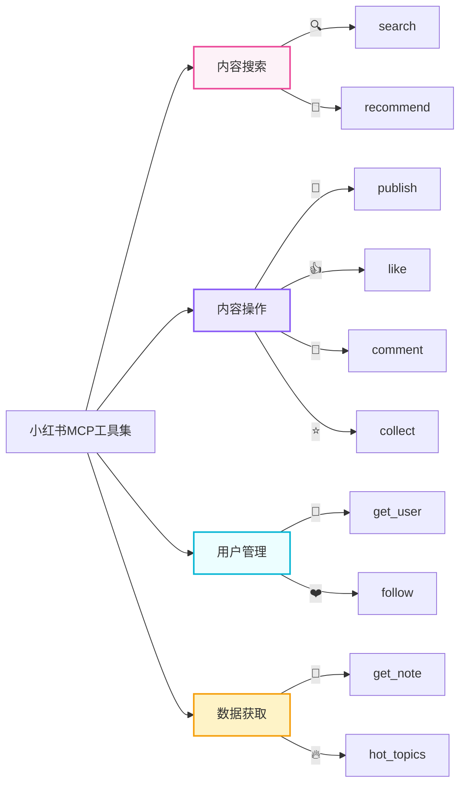

# MCP环境搭建与小红书MCP部署项目实战

<div class="mt-8 text-xl text-pink-500">Model Context Protocol 实战课程</div>
<div class="mt-12 opacity-60">探索AI模型与外部工具的连接之道</div>

<style>
:root {
  --primary: #ec4899;
  --secondary: #8b5cf6;
  --accent: #06b6d4;
}
</style>

---

## 📋 目录

<div class="grid grid-cols-2 gap-4 mt-8">
  <div class="p-4 bg-gradient-to-br from-pink-50 to-rose-50 rounded-xl border border-pink-200 hover:shadow-lg transition-shadow">
    <span class="text-pink-500 font-bold text-xl">01</span>
    <div class="mt-2 font-medium text-gray-700">MCP概述与架构</div>
  </div>
  <div class="p-4 bg-gradient-to-br from-purple-50 to-violet-50 rounded-xl border border-purple-200 hover:shadow-lg transition-shadow">
    <span class="text-purple-500 font-bold text-xl">02</span>
    <div class="mt-2 font-medium text-gray-700">环境准备与安装</div>
  </div>
  <div class="p-4 bg-gradient-to-br from-cyan-50 to-sky-50 rounded-xl border border-cyan-200 hover:shadow-lg transition-shadow">
    <span class="text-cyan-500 font-bold text-xl">03</span>
    <div class="mt-2 font-medium text-gray-700">MCP Server搭建</div>
  </div>
  <div class="p-4 bg-gradient-to-br from-pink-50 to-purple-50 rounded-xl border border-pink-200 hover:shadow-lg transition-shadow">
    <span class="text-pink-500 font-bold text-xl">04</span>
    <div class="mt-2 font-medium text-gray-700">小红书工具开发</div>
  </div>
  <div class="p-4 bg-gradient-to-br from-purple-50 to-cyan-50 rounded-xl border border-purple-200 hover:shadow-lg transition-shadow">
    <span class="text-purple-500 font-bold text-xl">05</span>
    <div class="mt-2 font-medium text-gray-700">客户端集成与部署</div>
  </div>
  <div class="p-4 bg-gradient-to-br from-cyan-50 to-pink-50 rounded-xl border border-cyan-200 hover:shadow-lg transition-shadow">
    <span class="text-cyan-500 font-bold text-xl">06</span>
    <div class="mt-2 font-medium text-gray-700">功能演示与总结</div>
  </div>
</div>

---

## 🔗 什么是 MCP?

<div class="mt-6 text-center">
  <span class="text-8xl">🔗</span>
</div>

<h2 class="text-3xl font-bold mt-6 bg-gradient-to-r from-pink-500 via-purple-500 to-cyan-500 bg-clip-text text-transparent">
  MCP (Model Context Protocol)
</h2>

<p class="text-xl text-gray-600 mt-4">
  用于连接AI模型与外部工具的标准化协议
</p>



---

## ✨ MCP核心价值

<div class="grid grid-cols-2 gap-6 mt-6">
  <div class="p-6 bg-gradient-to-r from-pink-50 to-pink-100 rounded-2xl border border-pink-200">
    <div class="text-4xl text-center mb-4">🚀</div>
    <h3 class="font-bold text-gray-800 text-center">能力扩展</h3>
    <p class="text-sm text-gray-600 mt-2 text-center">让AI模型具备调用外部工具的能力</p>
  </div>
  
  <div class="p-6 bg-gradient-to-r from-purple-50 to-purple-100 rounded-2xl border border-purple-200">
    <div class="text-4xl text-center mb-4">🔗</div>
    <h3 class="font-bold text-gray-800 text-center">标准接口</h3>
    <p class="text-sm text-gray-600 mt-2 text-center">统一的工具调用协议</p>
  </div>
  
  <div class="p-6 bg-gradient-to-r from-cyan-50 to-cyan-100 rounded-2xl border border-cyan-200">
    <div class="text-4xl text-center mb-4">🔒</div>
    <h3 class="font-bold text-gray-800 text-center">安全可控</h3>
    <p class="text-sm text-gray-600 mt-2 text-center">权限管理与执行隔离</p>
  </div>
  
  <div class="p-6 bg-gradient-to-r from-orange-50 to-orange-100 rounded-2xl border border-orange-200">
    <div class="text-4xl text-center mb-4">📦</div>
    <h3 class="font-bold text-gray-800 text-center">插件化设计</h3>
    <p class="text-sm text-gray-600 mt-2 text-center">工具可插拔，易于扩展</p>
  </div>
</div>

---

## 🏗️ MCP架构详解



<div class="mt-6 grid grid-cols-3 gap-4">
  <div class="text-center p-4 bg-pink-50 rounded-xl">
    <div class="text-3xl">🌐</div>
    <div class="mt-2 font-medium text-gray-700">服务端</div>
  </div>
  <div class="text-center p-4 bg-purple-50 rounded-xl">
    <div class="text-3xl">🛠️</div>
    <div class="mt-2 font-medium text-gray-700">工具层</div>
  </div>
  <div class="text-center p-4 bg-cyan-50 rounded-xl">
    <div class="text-3xl">🤖</div>
    <div class="mt-2 font-medium text-gray-700">客户端</div>
  </div>
</div>

---

## 📦 第一阶段：环境准备

### 系统要求检查

<div class="grid grid-cols-2 gap-4 mt-6">
  <div class="p-4 bg-green-50 rounded-xl border border-green-200 flex items-center gap-3">
    <span class="text-green-500 text-2xl">✓</span>
    <div>
      <div class="font-bold text-gray-800">Node.js</div>
      <div class="text-sm text-gray-600">版本 >= 18.0.0</div>
    </div>
  </div>
  
  <div class="p-4 bg-green-50 rounded-xl border border-green-200 flex items-center gap-3">
    <span class="text-green-500 text-2xl">✓</span>
    <div>
      <div class="font-bold text-gray-800">npm</div>
      <div class="text-sm text-gray-600">版本 >= 9.0.0</div>
    </div>
  </div>
  
  <div class="p-4 bg-green-50 rounded-xl border border-green-200 flex items-center gap-3">
    <span class="text-green-500 text-2xl">✓</span>
    <div>
      <div class="font-bold text-gray-800">Git</div>
      <div class="text-sm text-gray-600">版本 >= 2.30</div>
    </div>
  </div>
  
  <div class="p-4 bg-yellow-50 rounded-xl border border-yellow-200 flex items-center gap-3">
    <span class="text-yellow-500 text-2xl">⚠</span>
    <div>
      <div class="font-bold text-gray-800">Python</div>
      <div class="text-sm text-gray-600">版本 >= 3.10 (可选)</div>
    </div>
  </div>
</div>

```bash {all}
# 检查命令
node -v    # v20.10.0
npm -v     # 10.2.3
git --version  # git version 2.42.0
```

---

## 🚀 第二阶段：创建项目

### 项目初始化

```bash {all}
mkdir mcp-xiaohongshu-project
cd mcp-xiaohongshu-project
npm init -y

# 安装核心依赖
npm install @mcp/core @mcp/server express cors

# 安装开发依赖
npm install -D typescript ts-node @types/node @types/express @types/cors
```

### 项目结构

<div class="p-6 bg-gradient-to-r from-purple-50 to-pink-50 rounded-xl border border-purple-200 mt-6">
  <div class="font-bold text-gray-800 mb-3">📁 项目结构</div>
  <pre class="text-sm bg-white/70 rounded-lg p-4 overflow-x-auto">
mcp-xiaohongshu-project/
├── src/
│   ├── tools/          # 工具实现（小红书工具等）
│   ├── server/         # MCP服务端配置
│   ├── client/         # 客户端SDK封装
│   └── config/         # 配置文件
├── package.json        # 项目依赖配置
├── tsconfig.json       # TypeScript配置
└── .env               # 环境变量
  </pre>
</div>

---

## ⚙️ 第三阶段：配置 TypeScript

创建 `tsconfig.json`:

```json
{
  "compilerOptions": {
    "target": "ES2022",
    "module": "ESNext",
    "moduleResolution": "bundler",
    "strict": true,
    "esModuleInterop": true,
    "skipLibCheck": true,
    "outDir": "./dist",
    "rootDir": "./src",
    "resolveJsonModule": true
  },
  "include": ["src/**/*"],
  "exclude": ["node_modules"]
}
```

<div class="mt-6 p-4 bg-gradient-to-r from-cyan-50 to-blue-50 rounded-xl border border-cyan-200">
  <div class="flex items-center gap-2 text-cyan-600">
    <span class="text-xl">💡</span>
    <span class="font-medium">小贴士</span>
  </div>
  <p class="text-sm text-gray-600 mt-2">
    使用 ES2022 目标版本可以充分利用现代 JavaScript 特性，同时保持良好的兼容性。strict 模式确保代码质量。
  </p>
</div>

---

## 🔍 第四阶段：实现小红书工具

### 工具列表

<div class="grid grid-cols-2 gap-4">
  <div class="p-4 bg-gradient-to-br from-pink-50 to-rose-50 rounded-xl border border-pink-200">
    <div class="font-bold text-pink-600">🔍 xiaohongshu_search</div>
    <div class="text-sm text-gray-600 mt-1">搜索小红书笔记</div>
  </div>
  <div class="p-4 bg-gradient-to-br from-purple-50 to-violet-50 rounded-xl border border-purple-200">
    <div class="font-bold text-purple-600">📄 xiaohongshu_get_note</div>
    <div class="text-sm text-gray-600 mt-1">获取笔记详情</div>
  </div>
  <div class="p-4 bg-gradient-to-br from-cyan-50 to-sky-50 rounded-xl border border-cyan-200">
    <div class="font-bold text-cyan-600">📝 xiaohongshu_publish</div>
    <div class="text-sm text-gray-600 mt-1">发布小红书笔记</div>
  </div>
  <div class="p-4 bg-gradient-to-br from-green-50 to-emerald-50 rounded-xl border border-green-200">
    <div class="font-bold text-green-600">👤 xiaohongshu_get_user</div>
    <div class="text-sm text-gray-600 mt-1">获取用户信息</div>
  </div>
  <div class="p-4 bg-gradient-to-br from-orange-50 to-amber-50 rounded-xl border border-orange-200">
    <div class="font-bold text-orange-600">🔥 xiaohongshu_hot_topics</div>
    <div class="text-sm text-gray-600 mt-1">获取热门话题</div>
  </div>
  <div class="p-4 bg-gradient-to-br from-rose-50 to-pink-50 rounded-xl border border-rose-200">
    <div class="font-bold text-rose-600">👍 xiaohongshu_like</div>
    <div class="text-sm text-gray-600 mt-1">点赞笔记</div>
  </div>
</div>

---

## 🗺️ 工具功能架构



---

## 🔗 第五阶段：客户端集成

### 客户端SDK封装

```typescript
import { createClient } from '@mcp/core'

const client = createClient({
  serverUrl: 'http://localhost:8080',
  apiKey: process.env.MCP_API_KEY,
})

export async function searchNotes(keyword: string, options?: { page?: number; limit?: number }) {
  const result = await client.execute('xiaohongshu_search', {
    keyword, 
    page: options?.page || 1, 
    limit: options?.limit || 10,
  })
  return result.success ? result.data : null
}

export async function getHotTopics(limit?: number) {
  const result = await client.execute('xiaohongshu_hot_topics', { limit: limit || 10 })
  return result.success ? result.data : null
}
```

---

## 🚢 部署方案

<div class="grid grid-cols-2 gap-6">
  <div class="p-6 bg-gradient-to-br from-green-50 to-emerald-50 rounded-2xl border border-green-200">
    <div class="text-5xl text-center mb-4">🐳</div>
    <h3 class="font-bold text-green-700 text-center mb-3">Docker部署</h3>
    <pre class="text-xs bg-white/70 rounded-lg p-3 overflow-x-auto text-gray-600">
# 创建Dockerfile
FROM node:20-alpine
WORKDIR /app
COPY package*.json ./
RUN npm ci --only=production
COPY dist/ ./dist/
EXPOSE 8080
CMD ["node", "dist/server.js"]

# 构建并运行
docker build -t mcp-server .
docker run -d -p 8080:8080 mcp-server
    </pre>
  </div>
  
  <div class="p-6 bg-gradient-to-br from-amber-50 to-yellow-50 rounded-2xl border border-amber-200">
    <div class="text-5xl text-center mb-4">🚀</div>
    <h3 class="font-bold text-amber-700 text-center mb-3">PM2管理</h3>
    <pre class="text-xs bg-white/70 rounded-lg p-3 overflow-x-auto text-gray-600">
# 安装PM2
npm install -g pm2

# 配置ecosystem.config.js
module.exports = {
  apps: [{
    name: 'mcp-server',
    script: 'dist/server.js',
    instances: 'max',
    exec_mode: 'cluster'
  }]
}

# 启动服务
pm2 start ecosystem.config.js
pm2 monit
    </pre>
  </div>
</div>

---

## 🎯 功能演示

```typescript
import { searchNotes, getHotTopics, likeNote, followUser } from './client'

async function demoAllFeatures() {
  console.log('=== 1. 搜索笔记 ===')
  const searchResults = await searchNotes('旅行攻略', { limit: 3 })
  console.log('找到:', searchResults.data.length, '条笔记')

  console.log('\n=== 2. 获取热门话题 ===')
  const topics = await getHotTopics(5)
  topics.data.forEach(t => console.log(`${t.rank}. ${t.name}`))

  console.log('\n=== 3. 点赞笔记 ===')
  await likeNote('note_123')
  console.log('点赞成功!')

  console.log('\n=== 4. 关注用户 ===')
  await followUser('user_456')
  console.log('关注成功!')
}

demoAllFeatures()
```

---

## 📊 项目总结

### ✅ 已完成工作

<div class="grid grid-cols-3 gap-4 mt-6">
  <div class="p-4 bg-white/20 backdrop-blur-sm rounded-xl text-center">
    <div class="text-3xl">✅</div>
    <div class="mt-2 font-medium">环境搭建</div>
  </div>
  <div class="p-4 bg-white/20 backdrop-blur-sm rounded-xl text-center">
    <div class="text-3xl">✅</div>
    <div class="mt-2 font-medium">MCP Server配置</div>
  </div>
  <div class="p-4 bg-white/20 backdrop-blur-sm rounded-xl text-center">
    <div class="text-3xl">✅</div>
    <div class="mt-2 font-medium">小红书工具开发</div>
  </div>
  <div class="p-4 bg-white/20 backdrop-blur-sm rounded-xl text-center">
    <div class="text-3xl">✅</div>
    <div class="mt-2 font-medium">客户端SDK封装</div>
  </div>
  <div class="p-4 bg-white/20 backdrop-blur-sm rounded-xl text-center">
    <div class="text-3xl">✅</div>
    <div class="mt-2 font-medium">部署方案</div>
  </div>
  <div class="p-4 bg-white/20 backdrop-blur-sm rounded-xl text-center">
    <div class="text-3xl">✅</div>
    <div class="mt-2 font-medium">安全防护</div>
  </div>
</div>

---

## 🔮 未来扩展

<div class="grid grid-cols-3 gap-4 mt-6">
  <div class="p-6 bg-gradient-to-br from-pink-50 to-rose-50 rounded-xl border border-pink-200 hover:shadow-lg transition-shadow">
    <div class="text-4xl text-center mb-3">🚀</div>
    <h3 class="font-bold text-gray-800 text-center">扩展工具</h3>
    <p class="text-sm text-gray-600 mt-2 text-center">发布笔记、数据分析、批量操作</p>
  </div>
  <div class="p-6 bg-gradient-to-br from-purple-50 to-violet-50 rounded-xl border border-purple-200 hover:shadow-lg transition-shadow">
    <div class="text-4xl text-center mb-3">🔄</div>
    <h3 class="font-bold text-gray-800 text-center">模型集成</h3>
    <p class="text-sm text-gray-600 mt-2 text-center">对接更多AI平台，实现智能交互</p>
  </div>
  <div class="p-6 bg-gradient-to-br from-cyan-50 to-sky-50 rounded-xl border border-cyan-200 hover:shadow-lg transition-shadow">
    <div class="text-4xl text-center mb-3">📊</div>
    <h3 class="font-bold text-gray-800 text-center">可视化</h3>
    <p class="text-sm text-gray-600 mt-2 text-center">仪表盘、监控面板、数据报表</p>
  </div>
</div>

---

# 🎉 谢谢观看!

## MCP环境搭建与小红书MCP部署项目实战

<div class="mt-8 flex justify-center gap-8 text-lg opacity-80">
  <a href="https://mcp.dev" target="_blank" class="hover:text-pink-500 transition-colors">📖 官方文档</a>
  <a href="https://github.com" target="_blank" class="hover:text-purple-500 transition-colors">💻 代码仓库</a>
</div>

<div class="mt-8 text-sm opacity-60">
  如有问题，请随时联系！
</div>
