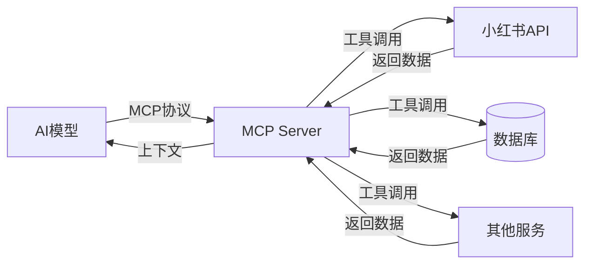
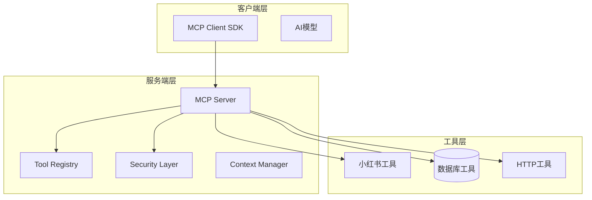
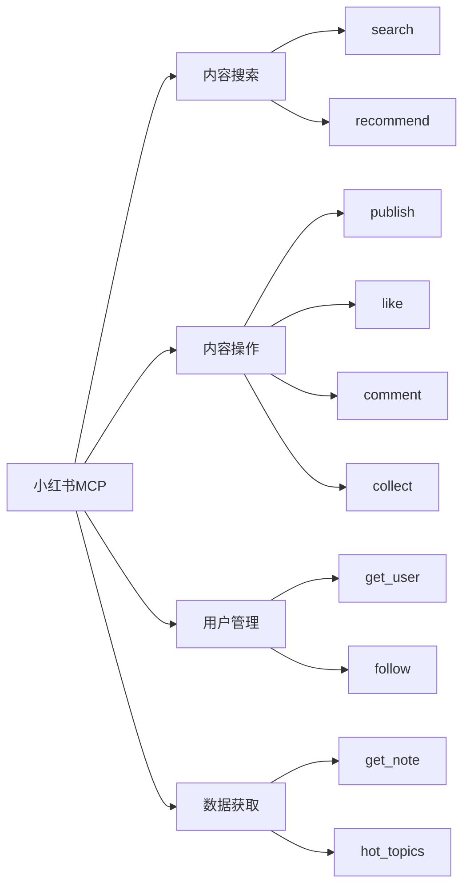

# MCP环境搭建与小红书MCP部署项目实战

**Model Context Protocol 实战课程**

探索AI模型与外部工具的连接之道

---

## 目录

| 序号 | 章节 |
|------|------|
| 01 | MCP概述与架构 |
| 02 | 环境准备与安装 |
| 03 | MCP Server搭建 |
| 04 | 小红书工具开发 |
| 05 | 客户端集成与部署 |
| 06 | 功能演示与总结 |

---

## 什么是 MCP?

**MCP (Model Context Protocol)**

用于连接AI模型与外部工具的标准化协议



---

## MCP核心价值

- 🚀 能力扩展：让AI模型具备调用外部工具的能力
- 🔗 标准接口：统一的工具调用协议
- 🔒 安全可控：权限管理与执行隔离
- 📦 插件化设计：工具可插拔，易于扩展

---

## MCP架构详解



---

## 第一阶段：环境准备

### 系统要求

| 软件 | 版本要求 |
|------|----------|
| Node.js | >= 18.0.0 |
| npm | >= 9.0.0 |
| Git | >= 2.30 |

### 检查命令

```bash
node -v   # 检查Node.js版本
npm -v    # 检查npm版本
git --version  # 检查Git版本
```

---

## 第二阶段：创建项目

### 项目初始化

```bash
mkdir mcp-xiaohongshu-project
cd mcp-xiaohongshu-project
npm init -y

npm install @mcp/core @mcp/server express cors
npm install -D typescript ts-node @types/node @types/express @types/cors
```

### 项目结构

```
mcp-xiaohongshu-project/
├── src/
│   ├── tools/
│   ├── server/
│   ├── client/
│   └── config/
├── package.json
├── tsconfig.json
└── .env
```

---

## 第三阶段：配置 TypeScript

创建 `tsconfig.json`:

```json
{
  "compilerOptions": {
    "target": "ES2022",
    "module": "ESNext",
    "moduleResolution": "bundler",
    "strict": true,
    "esModuleInterop": true,
    "skipLibCheck": true,
    "outDir": "./dist",
    "rootDir": "./src",
    "resolveJsonModule": true
  },
  "include": ["src/**/*"],
  "exclude": ["node_modules"]
}
```

---

## 第四阶段：实现小红书工具

### 工具列表

| 工具名称 | 功能描述 |
|---------|---------|
| xiaohongshu_search | 搜索笔记 |
| xiaohongshu_get_note | 获取笔记详情 |
| xiaohongshu_publish | 发布笔记 |
| xiaohongshu_get_user | 获取用户信息 |
| xiaohongshu_hot_topics | 获取热门话题 |
| xiaohongshu_like | 点赞笔记 |
| xiaohongshu_comment | 评论笔记 |
| xiaohongshu_follow | 关注用户 |

---

## 工具功能架构



---

## 第五阶段：客户端集成

### 客户端SDK封装

```typescript
import { createClient } from '@mcp/core'

const client = createClient({
  serverUrl: 'http://localhost:8080',
  apiKey: process.env.MCP_API_KEY,
})

export async function searchNotes(keyword: string, options?: { page?: number; limit?: number }) {
  const result = await client.execute('xiaohongshu_search', {
    keyword, page: options?.page || 1, limit: options?.limit || 10,
  })
  return result.success ? result.data : null
}

export async function getHotTopics(limit?: number) {
  const result = await client.execute('xiaohongshu_hot_topics', { limit: limit || 10 })
  return result.success ? result.data : null
}
```

---

## 部署方案

### Docker部署

```bash
docker build -t mcp-server .
docker run -d -p 8080:8080 mcp-server
```

### PM2管理

```bash
pm2 start ecosystem.config.js
pm2 monit
```

---

## 功能演示

```typescript
import { searchNotes, getHotTopics, likeNote, followUser } from './client'

async function demo() {
  const results = await searchNotes('旅行攻略')
  console.log('搜索结果:', results.data.length, '条')
  
  const topics = await getHotTopics(5)
  console.log('热门话题:', topics.data.map(t => t.name))
  
  await likeNote('note_123')
  await followUser('user_456')
}

demo()
```

---

## 项目总结

### 已完成工作

- ✅ 环境搭建
- ✅ MCP Server配置
- ✅ 小红书工具开发
- ✅ 客户端SDK封装
- ✅ 部署方案
- ✅ 安全防护

### 未来扩展

- 🚀 扩展工具（发布笔记、数据分析）
- 🔄 模型集成（对接更多AI平台）
- 📊 可视化（仪表盘、监控面板）

---

# 谢谢观看!

## MCP环境搭建与小红书MCP部署项目实战

如有问题，请随时联系！
